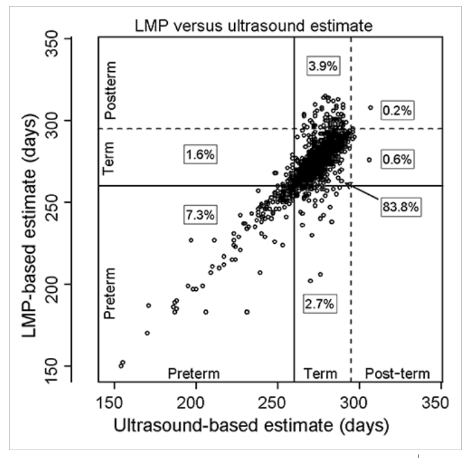
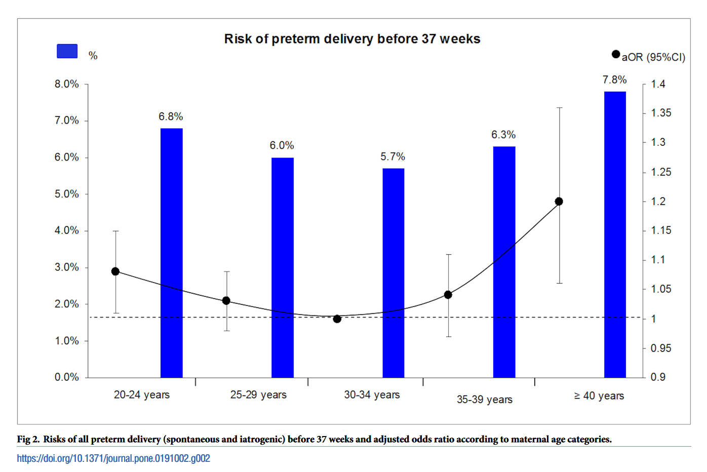
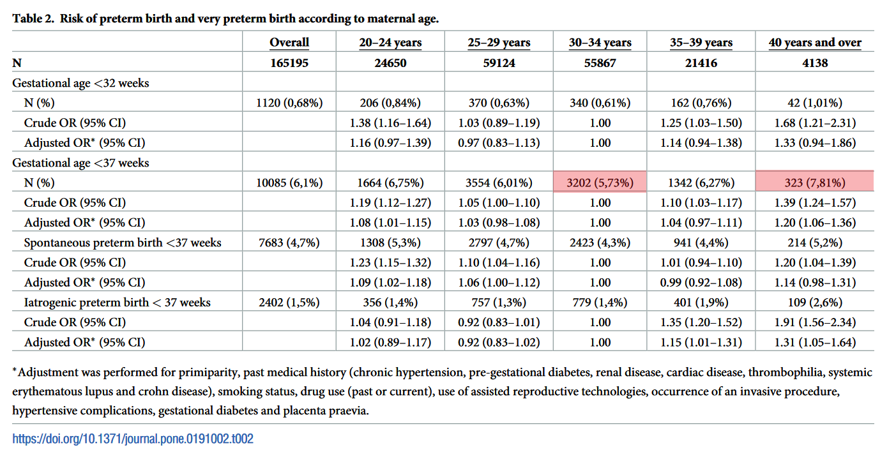

```{r setup, include=FALSE}
options(
	htmltools.dir.version = FALSE
)
library(tidyverse)
```

# The Task

"Objective of this submission study is to evaluate whether the concentration of biomarker ‘AB’ above a cutoff of 50ng/mL, measured at the 20th gestational week, could predict a preterm delivery for pregnant women. A known confounding factor is age.
Please prepare an analysis plan of approx. 10 presentation slides, covering at least the following aspects:

* study objective
* sample size
* primary analysis

and present it within 20 min to the audience. You may decide about further assumptions, e.g. about effect size of the biomarker or age. Important is that your analysis plan is coherent."


---
# Preliminaries

* I **focus on the statistical aspects** of the (statistical) analysis plan (SAP)

* Some overlap with trial protocol

* Formal requirements will be specified by the relevant SOPs and include
	* trial protocol version used
	* SAP version / date, *if applicable:* SAP revision + justification
	* roles, affiliations, and responsibilities of all persons involved 
		(data management, trial statistician, senior statistician, principal Investigator)
	* signatures of all contributors
	* references to relevant SOPs, Trial Master File
	
* I do not explicitly address 
	* exact variable derivation from data base
	* descriptive tables / listings

---
### Background: Preterm Delivery (PD) [1]

* 1 in 10 babies born before week 37 (in the US)
* **PD: established risk factor** for multitude of child morbidities

### Study Objective

* *"Objective of this submission study is to evaluate whether the concentration of biomarker 'AB' above a cutoff of 50ng/mL, measured at the 20th gestational week, could predict a preterm delivery for pregnant women."*

### Rationale for Study

* Identified early: **preventative care** for PD possible
* **Assumption:** AB measurable with ignorable risk to mother and child 
(e.g. maternal blood sample, vaginal secretion swab) $\leadsto$ positive risk-benefit


.footnote[

[1] Ferré C *et al.* 2007. *CDC*. http://dx.doi.org/10.15585/mmwr.mm6543a1

]

---
# Study Population & Endpoint

.pull-left[

* Eligible adult (18+) pregnant women

* PD: birth before week 37 [1]
	* gestational age varies by method [2]
	* **Assumption:** use ultrasound-based estimate

* **Assumption:** Stillbirths are PD  

* **Assumption:** Late abort is protocol violation

]

.pull-right[

```{r ga-methods, echo=FALSE, out.height="300px", fig.align="center"}

```

]

.footnote[

[2] Hoffman CS *et al.* 2008. Comparison of gestational age at birth based on last menstrual period and ultrasound during the first trimester. Paediatr Perinat Epidemiol. doi:10.1111/j.1365-3016.2008.00965.x.

]

---
# Statistical Model

* Binary biomarker, cutoff already fixed: $\operatorname{AB}_{0/1} := \operatorname{AB}(20) \geq 50\operatorname{ng/mL}$

* Maternal age is **confounder** $\leadsto$ affects both risk of $\operatorname{PD}$ and level of $\operatorname{AB}_{0/1}$

```{tikz diagram, fig.ext = 'png', echo=FALSE}
\usetikzlibrary{arrows,arrows.meta,automata,positioning}
\tikzset{
    state/.style={
           rectangle,
           rounded corners,
           draw=black, very thick,
           minimum height=2em,
           inner sep=5pt,
           outer sep=5pt,
           text centered,
           },
}
\definecolor{zzffzz}{rgb}{0.6,1,0.6}
\definecolor{ffcctt}{rgb}{1,0.8,0.2}
\definecolor{yqyqdz}{rgb}{0.5019607843137255,0.5019607843137255,0.8509803921568627}
\begin{tikzpicture}
	\node [xshift=-3.75in](left) {};
	\node [xshift=3.75in](right) {};
	\node[state,%
		xshift=-1.5in,%
		anchor=center%
	] (PD) {$\operatorname{PD}$};
	\node[state,%
		yshift=-.5in,%
		anchor=center %
	] (age) {$\operatorname{Age}$};
	\node[state,%
		xshift=1.5in,%
		anchor=center %
	] (AB) {$\operatorname{AB}_{0/1}$};
	\draw [-{Stealth[scale=1.5]}] (age) -- node[above] {(a)} (PD);
	\draw [-{Stealth[scale=1.5]}] (age) -- node[above] {(b)} (AB);
	\draw [-{Stealth[scale=1.5]}] (AB) -- node[above] {(c)} (PD);
\end{tikzpicture}
```

* Logistic regression model: $\operatorname{PD} \sim \operatorname{Age} + \operatorname{AB}_{0/1}$, adjust for confounder

* **Assumption:** no relevant interaction effect between $\operatorname{Age}$ and $\operatorname{AB}_{0/1}$

* Let $\beta_{\operatorname{AB}}$ be regression coefficient of $\operatorname{AB}_{0/1}$ (adjusted log OR)

* $\mathcal{H}_0: \beta_{\operatorname{AB}} = 0$, test via asymptotic, model-based t-test [1]

.footnote[

[1] Alternative: Cochran-Mantel-Haenszel test, more later

]


---
# Caveat: Age Effect

.pull-left[

* Maternal age: continuous

* Linear effect on log-odds of PD implausible [1] $\leadsto$ biased $\widehat{\beta_{\operatorname{AB}}}$

* Solution: binned age groups $\leadsto$ captures non-linear effect

* Define discrete maternal $\operatorname{Age}_{dscr}$ using categories from [1] (starting at 18 years)

]

.pull-right[

```{r pd-vs-age, echo=FALSE, out.height="300px", fig.align="center"}

```

]

.footnote[

[1] Fuchs *et al.* 2018. *PLOS One*. doi:10.1371/journal.pone.0191002

]


---
# Study Design

* Endpoint properties:
	1. Delayed response (0 to 17 weeks)
	2. Common indication / broad target population
	3. **Assumption:** measuring AB is cheap (**low marginal cost** of inclusion)
	
* $\leadsto$ group-sequential design unlikely to be beneficial

* Better: recruit ASAP, single-stage, multi-centric 

* Adjust for center variation via random effect (save degrees of freedom)

* Blinding? Unethical if strong prior evidence of biomarker performance
	
* Calculate sample size according to [1] for simple logistic regression with binary predictor (essentially: unbalanced $\chi^2$ test)

.footnote[

	[1] Hsieh FY *et al.* 1998. Statistics in Medicine. https://doi.org/10.1002/(SICI)1097-0258(19980730)17:14%3C1623::AID-SIM871%3E3.0.CO;2-S
	
]


---
# Sample Size - Inputs

1. Overall event rate, $\operatorname{Pr}[\operatorname{PD}=1]$: 1 in 10

2. Prevalence, $\operatorname{Pr}[\operatorname{AB}_{0/1} = 1]$ 

3. Effect size: $\operatorname{Pr}[\operatorname{PD} = 1|\operatorname{AB}_{0/1} = 1] - \operatorname{Pr}[\operatorname{PD} = 1|\operatorname{AB}_{0/1} = 0]$

4. Correlation coefficient $\rho$ of age and AB (for variance inflation factor)

5. Conditional error rates $\alpha=0.05$ (two-sided), $\beta=0.1$ [1]

6. Dropout rate, combination of:
	1. Stillbirth
	2. Abort
	3. Withdrawal of consent 
	4. Loss-to-follow-up

.footnote[

[1] $\beta$ could be chosen smaller depending on 
projected market value $\leadsto$ utility maximization

]


---
# Sample Size - Assumptions

1. Proportion of target population with $\operatorname{AB}_{20} \geq 50\operatorname{ng/mL}$ 
	* unlike to be very extreme 
		($>>.5\leadsto$ cannot expect big risk difference, $<<.5$ economically uninteresting)
	* Has to be part of trial rationale/protocol and previously assessed
	* **Assumption:** 1 in 3 $\operatorname{AB}_{20} \geq 50\operatorname{ng/mL}$ 

4. Correlation coefficient $\rho$ of age and biomarker (for variance inflation factor)
	* needs to be positive for age to be a confounder
	* cannot be too big since age would otherwise be a sufficient proxy for AB
	* **Assumption:** $\rho=0.1$

6. Dropout rate
	* late miscarriages (post 20 weeks) and iatrogenic aborts very rate ($<<2%$)
	* withdrawal of consent + loss-to-follow-up could be an issue since long follow-up and low-stakes towards the end
	* **Assumption:** $2\% + 5\% = 7\%$
	


---
# Effect Size

```{r pd-risk, echo=FALSE, out.height="250px", fig.align="center"}

```

* maximal age effect is be about 2%

* **Assumption:** A (very) good biomarker might have twice the effect of age

* **Assumption:** Population average risk difference of $4\%$ between AB+ and AB-

.footnote[

[1] Fuchs *et al.* 2018. *PLOS One*. doi:10.1371/journal.pone.0191002

]


---
# *Fiat n*

.pull-left[

```{r sample-size, include=FALSE}
source("../R/sample_size.R")
rho <- .1
dropout <- .07
alpha <- .05
beta <- .1
prev <- 1/3
pd_rate <- 1/10
n <- sample_size(
	risk_difference = 4/100, # biomarker pos - biomarker neg
	prevalence_biomarker = prev,
	overall_event_rate = pd_rate,
	alpha = alpha,
	beta = beta
)
```

* Assumptions $\leadsto n=`r ceiling(n)`$

* With VIF: $n=`r ceiling(n / (1 - rho^2))`$

* With dropout: $n = `r ceiling(n / (1 - rho^2) * (1 + dropout))` \approx 3000$

* @15 centers $\approx 200$ per center, i.e. $\approx 20$ PD cases per center

* Minimum of $100$ per center to avoid centers without PD (random effect unidentifiable!)

* 15 centers $\times$ 5 age groups $=$ 60 strata for CMH test - unstable $\leadsto$ prefer logistic regression model

]

.pull-right[

```{r plot-sample-size, echo=FALSE, out.height="400px", fig.height=5.5, fig.width=4.5, dpi=600, warning=FALSE, fig.align="center"}
tbl_n <- tibble(
		delta = seq(0.01, 0.075, length.out = 100),
		`no dropout or VIF` = map_dbl(
				delta, 
				~sample_size(., 
					prevalence_biomarker = prev,
					overall_event_rate = pd_rate,
					alpha = alpha,
					beta = beta
				)
			),
		`no dropout` = `no dropout or VIF` / (1 - rho^2),
		`dropout and VIF` = `no dropout` * (1 + dropout)
	) %>% 
	pivot_longer(
		-delta,
		names_to = "type",
		values_to = "required sample size"
	)

ggplot(tbl_n) +
	aes(delta, `required sample size`, color = type) +
	geom_line() +
	geom_vline(xintercept = .04) +
	geom_hline(yintercept =  ceiling(n / (1 - rho^2) * (1 + dropout))) +
	scale_y_continuous(limits = c(0, 10000), breaks = seq(0, 10000, by = 1000), expand = c(0, 0)) +
	scale_x_continuous(limits = c(0, .075), breaks = seq(0, 1, by = .01), expand = c(0, 0)) +
	scale_color_discrete("") +
	theme(
		legend.position = "top"
	)
```

]


---
# Trial Duration

* **Assumption:** average birth clinic $\approx 1500$ births per year [1]
	
* **Assumption:** negligible risk from measuring AB $\leadsto$ 10% recruitment $\leadsto 150/center/year$

* delayed response of (mostly) 17 weeks $\approx 4$ months for normal pregnancy

* $\leadsto$ Overall duration from recruitment start: about 1.5 to 2 years
	
.footnote[

[1] Anecdotal evidence: St. Elisabeth Clinic, Heidelberg, Germany

]


---
# Missing Values

* Low rate of dropout expected ( $\approx 5\%$ )- power not an issue, bias?

* MCAR debatable: 
	* plausible: dropout chance increases with calendar time (less severe consequences the closer to 37 weeks)
	* if AB is indeed prognostic it is likely to affect *timing* of PD
	* $\leadsto$ missingness not independant of AB value

* In regression: CCA unbiased if missingness independent of outcome given predictor [1]

* Missingness unlikely to depend on $PD$ in week 20+ any medical follow-up required in all scenarios

* $\leadsto$ CCA is valid

.footnote[

[1]  White R, Carlin JB. 2010. Bias and efficiency of multiple imputation compared with complete-case analysis for missing covariate values. *Statistics in Medicine*, 28:2920–2931.

]


---
# Primary Analysis

* CCA of all participants who did not withdraw consent

* t-test for fixed effect of AB+ in mixed-effects logistic regression 
$PD \sim agediscrete + AB_discrete + (1 | center)$

* Mixed effects degrees of freedom for t-statistic: Satterthwaite method [1]

* using R 4.0.5 + lmer + lmertest

* report adjusted OR + 95% CI as effect measure and compare with aOR of Age groups

* report sensitivity / specificity with 95% CI


.footnote[

[1] http://dx.doi.org/10.18637/jss.v082.i13

]


---
# Further Points

* Study design:
	* Blinding of staff/subjects - ethical?
	* Preventive therapy: might delay but not prevent PD? What if it does?

* Sensitivity/secondary analyses:
	* Missing values worst/best case
	* Per-protocol analysis (e.g. exclude AB measurement outside of week 20)
	* ROC analysis of cont' AB - cut-off right?
	* Parametric survival analysis of 
	$$\operatorname{time-to-delivery} \sim \operatorname{Age}_{dscr} + \operatorname{AB}$$
	How does $AB$ influence 'birth hazard' between week 20 and 37?

* Sample Size:
	* Explore sample size / power interactively to determine best option
	* Bayesian sample size: prior on effect and nuisance parameters </br>
	$\leadsto$ minimize expected sample size or maximize expected utility
	
	

---
class: top, right
# Discussion

